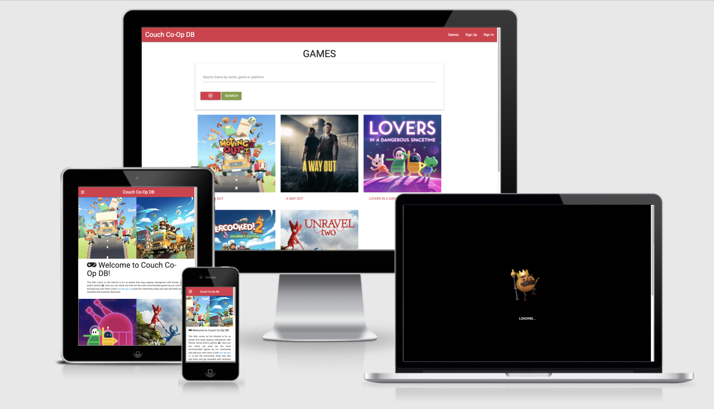

# Couch Co-Op DB

View the live project [here](https://couch-co-op-db.herokuapp.com/).

Couch Co-Op DB is a website for people that enjoy playing couch co-op videogames. The idea for this project is to create a space where players can become registered users and add their favourite games, share tips and tricks and rate them. Site visitors can read about the games and purchase them via a hyperlink to Steam that will provide them with a 20% discount voucher.

---

### **Contents** ###

- [UX](#ux-user-experience)
    - [Project Goals](#project-goals)
    - [User Stories](#user-stories)
    - [Site Owner Goals](#site-owner-goals)
    - [Design](#design)
        - [Wireframes](#wireframes)
        - [Database](#database)
        - [Fonts](#fonts)
        - [Colors](#colors)
- [Features](#features)
    - [Existing Features](#existing-features)
    - [Features Left to Implement](#features-left-to-implement)
- [Technologies Used](#technologies-used)
- [Testing](#testing)
- [Deployment](#deployment)
- [Credits](#credits)
    - [Code solutions and inspiration](#code-solutions-and-inspiration)
    - [Content](#content)
    - [Media](#media)
    - [Acknowledgements](#acknowledgements)

## UX (User Experience) ##

### **Project Goals** ###

The **goal** of this project is to build a website that allows people passionate about videogames to find the most played couch co-op games added by registered users, read comments from the community and get a direct link to purchase the games with a discount voucher.

### **User Stories** ###
#### **New Site Visitor** ####
- As a user, I want to be able to easily navigate to the different site pages.
- As a user, I want to see a page containing all games.
- As a user, I want to be able to register on the site.
- As a user, I want to be able to add new games and add comments.
- As a user, I want to be able to read other member’s reviews.
- As a user, I want to be able to search the site by games names, number of players and platform.
- As a user, I want to be able to find direct links to purchase the games I like.

#### **Returning Site Visitor** ####
- As a user, I want to see my user account profile page.
- As a user, I want to be able to update and/or delete any of the games I have added.
- As a user, I want to be able to mark games as favorites, so I can easily see them from my account page. 
- As a user, I want to be able to leave comments on the other games.

#### **Site Administrator** ####
- As an **Administrator**, I want to be able to add, edit and delete the games details.

### **Site Owner Goals** ###
- Create a co-op gaming community to increase site owner's following on Twitch and rest of social media. 
- Earn money every time a user purchases a game via the link provided on my site.
 

### **Design** ###

#### **Wireframes** ####
The wireframes for the website have been created with [Figma](https://www.figma.com/) and are available [here](https://www.figma.com/file/Z4haTyThhzKwdy75zFupo5/Couch-Co-Op-DB?node-id=0%3A1).
Tablet and mobile devices share the same layout, while a separate design has been created for the desktop views. 

While working on the project, I made some small adjustments to the original wireframes:
- On the **Home** page, the order of the menu has been changed to **Games Sign Up Sign In** instead of **Games Already a member? Sign In Sign Up**.
- The Admin UI has been simplified and instead of having another tab called **Manage Games**, the Admin user has been granted rights to edit and/or delete any games, regardless by whom these have been added. This made more sense to keep the design cleaner.
- For each game's page, the mark as favourite and shopping link buttons have been placed to the left instead, and the comment functionality button has been renamed to **POST**. 
- For both pages of legal content, ToU and Privacy Policy, a scrollspy has been added to improve the UX.

#### **Database** ####

#### - users collection
**Title**|**Key in Collection**|**Data Type**
:-----:|:-----:|:-----:
User ID|_id|ObjectId()
Username|username|String
Password|password|String
Admin|is_admin|String
Date Joined|date_joined|Date

#### - games collection
**Title**|**Key in Collection**|**Data Type**
:-----:|:-----:|:-----:
Game ID|_id|ObjectId()
Name|name|String
Description|description|String
Image|image_url|String
Players|number_players|String
Release Year|year_release|String
Genre|genre|String
Developer|developer|String
Publisher|publisher|String
Platforms|platforms|String
Shop|shop_link|String
Created by|created_by|String
Created date|created_date|Date

#### - favourites collection
**Title**|**Key in Collection**|**Data Type**
:-----:|:-----:|:-----:
Favourite ID|_id|ObjectId()
Game ID|game_id|ObjectId()
User ID|user_id|ObjectId()
Game Name|game_name|String
Game Image|game_image|String

#### - comments collection
**Title**|**Key in Collection**|**Data Type**
:-----:|:-----:|:-----:
Comment ID|_id|ObjectId()
Game ID|game_id|ObjectId()
Game Name|game_name|String
User ID|user_id|Object
Date|date_submitted|Date
Comment|text|String

#### - genres collection
This collection was created manually to populate the frontend dropdown for labelling a game with a specific genre. 
**Title**|**Key in Collection**|**Data Type**
:-----:|:-----:|:-----:
Genre ID|_id|ObjectId()
Genre|genre|String

Options displayed are: **action, adventure, party, puzzle, simulation, survival, horror, sports**.

A diagram of the database can also be checked for more details [here](static/images/database-diagram.png).

#### Data Types ####

- ObjectId
- Object
- String
- Date

#### **Fonts** ####
Roboto Google font with a Sans Serif fallback has been chosen for the entire website.

#### **Colors** ####
The color scheme is based on the colours of the *Moving Out* videogame and generated through the [Coolors](https://coolors.co/) website.
To keep it simple and relatable to the videogames, a two colors palette has been used, see [here](https://coolors.co/f7ba2e-db3549).

[Back to contents](#contents)

---

## Features

### Existing Features
The **features** on the website will:
- Allow site visitor to register a user account and access more functionalities, such as: add, comment and mark games as favourite.
- Display all couch co-op games that the community has added to enable visitors to read all the details and comments sharing tips and tricks.
- Provide a direct shopping link for each game to the Steam store, where they can get a 20% discount voucher when purchasing it.

I achieve this by:

- Providing registration and user authentication for users to create an account and see their account details.
- Enabling users to add new games and edit their entries. 
- Linking the game store to each game directly on the website.

#### Security Features
- Defensive programming to prevente brute force access to unauthorized pages, only available for registered visitors. 
- Verification of the username, preventing visitors to register more than one profile per username.
- Username and password validation before logging in.
- Form validation for input fields.
- Enable **only** users that posted a specific game to also edit and delete it.
- Reserve the rights to edit and delete to Admin user as well, so the website can be managed.
- If a user clicks Delete game by mistake, a modal is shown to request the user to confirm deletion or cancel the action.
- Buttons reserved for registered visitors are hidden from unregistered guests.
- Verification if a user has already marked a game as favourite to prevent from adding the same game multiple times.
- Error handlers to explain 404, 500 and 503 error types to visitors and redirect them to another place on the website.

### Features Left to Implement
- Create a dashboard to provide site visitors with statistics about all the games.
- Implement a star rating functionality that allows the users to upvote and downvote games depending on their preferences.
- Add additional functionalities to allow users to remove a game from favourites, and edit and/or delete their own comments.

[Back to contents](#contents)

---

## Technologies Used

### Languages Used
- [Python3](https://www.python.org/)
- [HTML5](https://en.wikipedia.org/wiki/HTML5)
- [CSS3](https://en.wikipedia.org/wiki/CSS)
- [JavaScript](https://en.wikipedia.org/wiki/JavaScript)

### Database
- [MongoDB](https://www.mongodb.com/)

### Frameworks, Libraries & Programs Used
- [Materialize](https://materializecss.com/)
    - Materialize CSS was used to design some elements on the pages as well as help with styling and responsiveness.
- [jQuery](https://jquery.com/)
    - JavaScript library.
- [Flask](https://palletsprojects.com/p/flask/)
    - Lightweight WSGI web application framework.
- [Jinja](https://jinja.palletsprojects.com/en/3.0.x/)
    - Templating engine for Python.
- [Werkzeug](https://werkzeug.palletsprojects.com/en/2.0.x/)
    - Comprehensive WSGI web application library.
- [PyMongo](https://pypi.org/project/pymongo/)
    - Python tool for working with MongoDB
- [Flask-PyMongo](https://flask-pymongo.readthedocs.io/en/latest/)
    - Flask-PyMongo bridges Flask and PyMongo and provides some convenience helpers.
- [dnspython](https://www.dnspython.org/)
    - Dnspython is a DNS toolkit for Python.
- [Hover.css](https://ianlunn.github.io/Hover/)
    - Hover.css was used for hoverable effects throughout the site.
- [Favicon.io](https://favicon.io/)
    - Favicon.io has been used to generate the favicon from an icon.
- [EmojiTerra](https://emojiterra.com/)
    - EmojiTerra was used for the couch and lamp emoji used for the favicon generation.
- [Google Fonts](https://fonts.google.com/)
    - Google font Roboto was chosen for the website and imported to the stylesheet. 
- [Font Awesome](https://fontawesome.com/)
    - Font Awesome was used throughout the sections to illustrate and complement the content, as well as improve UX.
- [Git](https://git-scm.com/)
    - Git was used for version control.
- [GitHub](https://github.com/)
    - GitHub was used to store the project's code.
- [RandomKeygen](https://randomkeygen.com/)
    - RandomKeygen was used to generate the passwords and keys for the website creation.
- [Termly](https://termly.io/)
    - Termly templates were used to create the privacy policy and the terms and conditions. 
- [Figma](https://www.figma.com/)
    - Figma was used to create the wireframes.
- [Coolors](https://coolors.co/)
    - Coolors was used to generate the colors palette used throughout the website.
- [Collage Maker | BeFunky](https://www.befunky.com/)
    - BeFunky was used to create the collage on the home page.
- [Freepik](https://www.freepik.com/)
    - Freepik images were used for the error handlers.
- [Autoprefixer](https://autoprefixer.github.io/) 
    - Used for adding CSS vendor prefixes to increase compatibility across browsers.
- [EZGIF.COM](https://ezgif.com/)
    - Used to optimize the preloader size and convert the format from gif to webp.
- [dbdiagram.io](https://dbdiagram.io/home)
    - Used to create the database diagram for README.md

### General Resources 
1. [Code Institute Course Content](https://learn.codeinstitute.net/dashboard)
2. Code Institute **Slack Community**
3. [MongoDB Documentation](https://docs.mongodb.com/)
4. [Python Documentation](https://www.python.org/doc/)
5. [Pallets Projects](https://www.palletsprojects.com/)
6. [W3Schools](https://www.w3schools.com/)
7. [Stack Overflow](https://stackoverflow.com/)

[Back to contents](#contents)

---

## Testing

All testing for the website has been collected [here](static/testing/TESTING.md).

[Back to contents](#contents)

---

## Deployment

### Heroku 

This project is hosted on [Heroku](https://couch-co-op-db.herokuapp.com/) and has been deployed by following the next steps:
1. Create a requirements.txt file that collects all required dependencies, by typing in the CLI `pip3 freeze --local > requirements.txt`.
2. Create a Procfile for Heroku by typing in the CLI: `echo web: python app.py > Procfile`. Delete blank line at the bottom of the Procfile to avoid problems when running the app on Heroku.
3. Push both the requirements.txt and Procfile to GitHub.
4. Log in to Heroku and click on "Create new app". Choose a unique name and use "dash" or "minus" instead of spaces and all lowercase letters. Select the region closest to you and click "Create app".
5. Within the app in Heroku, navigate to the "Deploy" tab and, under "Deployment method", click GitHub. 
6. Search for the repository name and, once it finds it, click "Connect" to connect the app.
7. Next, navigate to the "Settings" tab and click on "Reveal Config Vars". Here, the variables stored in the env.py file need to be entered:
    - IP: value of 0.0.0.0.
    - PORT: value of 5000
    - SECRET_KEY
    - MONGO_URI
    - MONGO_DBNAME: the value is the name of the database
8. Finally, back to the "Deploy" tab, under "Automatic deploys", select "Enable Automatic Deploys" and click "Deploy Branch".
9. The app is built and once it's done, a message will display "Your app was successfully deployed", then you can click View to launch it.

### Locally

You can clone this project and run it locally, by following the next steps:
1. Clone this project's repo from [here](https://github.com/MihaelaVacarus/Couch-Co-Op-DB) by clicking on "Code" and copying `gh repo clone MihaelaVacarus/Couch-Co-Op-DB`.
2. Open your IDE and paste it in the terminal. 
3. Install the modules listed in the requirements.txt file by typing `pip3 install -r requirements.txt` in the CLI.
4. In MongoDB, create a database called "couchCoOpDB" and replicate the collections specified in the [database section](#database).
5. In the root directory of your project, create an env.py file and remember to add it to your .gitignore file. The content of this env.py file will be:

```
import os

os.environ.setdefault("IP", "0.0.0.0")
os.environ.setdefault("PORT", "5000")
os.environ.setdefault("SECRET_KEY", "[YOUR SECRET KEY]")
os.environ.setdefault("MONGO_URI", "[YOUR MONGO URI"])
os.environ.setdefault("MONGO_DBNAME", "couchCoOpDB")
````

You will need to enter your own SECRET_KEY and MONGO_URI info.

6. You can now run the app locally by typing `python3 app.py` in the CLI and open it in your browser.

[Back to contents](#contents)

---

## Credits

### Code solutions and inspiration
- [StackOverflow](https://stackoverflow.com/questions/53438861/jinja2-using-images-in-html) solution for generating image path to be passed in Jinja template.
- [Flask Documentation](https://flask.palletsprojects.com/en/1.1.x/patterns/flashing/) on how to implement categories for flash messages.
- [StackOverflow](https://stackoverflow.com/questions/44569040/change-color-of-flask-flash-messages) solution for creating classes for flash messages.
- Code Institute's course content for teaching me how to build the CRUD functionalities on the site and for providing the user authentication code, which can also be checked here in the [Task Manager App](https://github.com/MihaelaVacarus/Task-Manager-App) that I coded following the Code Institute course content.
- [Learn Flask for Python](https://www.youtube.com/watch?v=Z1RJmh_OqeA) crash course on YouTube explaining how to use Flask with Python for code explanations.
- [Simon Vardy](https://github.com/simonjvardy/the-reading-room) and [Sean Young](https://github.com/seanyoung247/Plum) for project inspiration and ideas on layout.
- [WebP](https://developers.google.com/speed/webp) documentation for fixing the gif I had as preloader explaining that converting gif to WebP format is more efficient and improves performance.
- Nishan Chathuranga Wickramarathna's [article](https://nishanc.medium.com/how-to-add-a-gif-pre-loader-to-your-website-dcfd29bd055d) about how to add a preloader easily to websites.
- Code Institute's [Sample README](https://github.com/Code-Institute-Solutions/SampleREADME/blob/master/README.md) that provided me with a good base to build my README on.
- Adam Pritchard's [Markdown Cheatsheet](https://github.com/adam-p/markdown-here/wiki/Markdown-Cheatsheet) for explaining solutions on how to layout the README.
- [Materialize](https://materializecss.com/getting-started.html) small code snippets and documentation on how the framework is implemented, which helped me to easily style and make the website responsive.
- [Solution](https://stackoverflow.com/questions/4374185/regular-expression-match-to-test-for-a-valid-year) posted by RoR user on StackOverflow to implement pattern validation on year of release input field for the game forms.

### Content
Content about the games has been retrieved from the individual game sites on [Steam](https://store.steampowered.com/) and [Team17](https://www.team17.com/).

### Media
- [Overcooked Wiki Fandom](https://overcooked.fandom.com/wiki/Onion_King?file=Dancing_Onion_King.gif), namely user "Sunmarsh" for the Dancing Onion King gif.
- [Freepik](https://www.freepik.com/) supplied images for the error handlers.
- [Google Images](https://www.google.com/imghp?hl=EN).
- [Font Awesome](https://fontawesome.com/) icons used throughout the website.

### Acknowledgements
- My mentor Spencer Barriball for his guidance and feedback all along.
- Slack Community for reviewing my code and providing very useful advice and feedback.
- Tutor Assistance at CI for helping me troubleshoot various issues.
- Code Institute for the course contents that taught me the basics on which this project is built.
- My family and friends for testing the features and giving me honest feedback.

[Back to contents](#contents)

---
